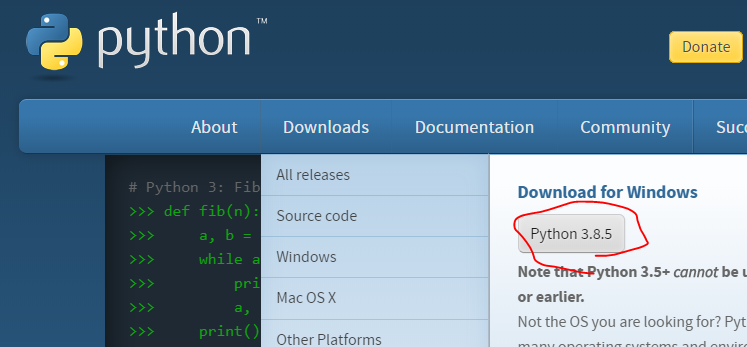

# SETUP

## 1. ターミナル環境のセットアップ

本チュートリアルではPythonをターミナルから実行するために、bashシェル環境のあるターミナルを用意する必要があります。

下記手順からセットアップをお願いします。

### Windows環境

**WSLとかなにかわからない人向け**
- [git for windows](https://gitforwindows.org/e)のインストールをお願いします。
- これをインストールすることで、 `Git Bash` というプログラムから、bash環境を起動できます。
- git bashを起動し、下記のような画面が表示されればOKです。


**[WSL (Windows Subsystem for Linux)](https://docs.microsoft.com/ja-jp/windows/wsl/install-win10)環境がある人向け**
- WSLの場合、bash環境があるのでターミナル準備の必要はありません
- しかしWSL2ではあとから自分でディストリビューショををインストールする必要があります。本手順ではUbuntuを前提として記載します。

**独自の環境を用意し、自力で解決できる人向け**

- その他いろいろな方法でターミナル環境を用意できます
  - Dockerを使う
  - PowerShellやCMD.exeから頑張る
- PCに余計なものをインストールしたくない人はこちらでも問題ありませんが、サポートしきれない可能性があるので、自力で解決できる人向けです

### MacOS環境

Macの場合は標準でインストールされているターミナルアプリでbash環境を用意できるのでスキップで問題ないです

### Linux環境

Linuxも標準のターミナルソフトで問題ないです

## 2. Python 3.6以上のインストール

本チュートリアルではPython3.6以上の環境が必要になります。

まずは下記コマンドをターミナルで実行し、Python3.6以上の環境かどうかをチェックしてください。

```
python --version
```

もしくは

```
python3 --version
```

Pythonのバージョンが表示されますが、3.6以上の場合はOKです。この手順はスキップしてください

3.6以下が表示された、もしくはエラーになってバージョンが表示されなかった場合は新規にインストールをする必要があります。

以下の手順でインストールをお願いします

### Windows環境

**WSLをつかわない人向け**
- [Python公式サイト](https://www.python.org/)からDownloads > Download for WindowsでPython3.8.5をインストールしてください。

- 下記コマンドをgit bashで入力し、PATHをとおします。
```
echo 'PATH=~/AppData/Local/Programs/Python/Python38-32:$PATH' >> ~/.bash_profile
echo 'alias python3="python"' >> ~/.bash_profile
```

**WSLを使う人向け**

Ubuntuの場合、標準でPython3が入っています

**その他環境**

各位頑張ってください。Powershellの場合は同様に公式サイトからインストールできるはずです

### Mac環境

- `python3 --version` で3.6以上が入っていればいいですが、入っていない場合は下記サイトを参考にしてインストールしてください
- [MacにPython3をインストールし環境構築【決定版】](https://qiita.com/7110/items/1aa5968022373e99ae28)

### Linux環境

```
sudo apt update && sudo apt install python3
```

## 3. リポジトリのclone

こちらのリポジトリをお好きなディレクトリにcloneしてください
```
cd お好きなディレクトリ

git clone https://github.com/garicchi/machine-learning-basic.git
```